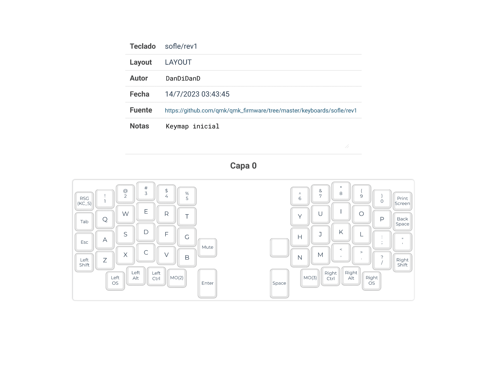
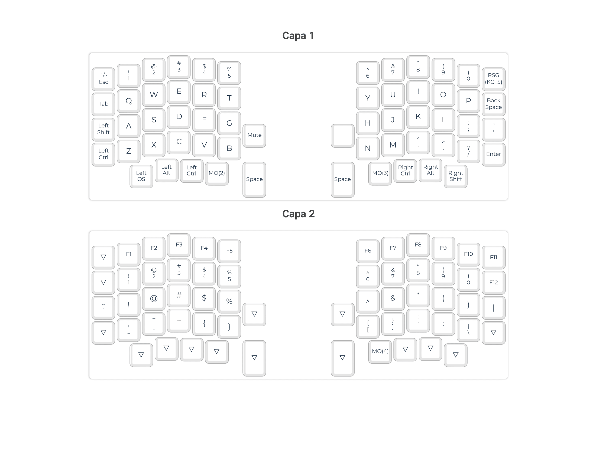
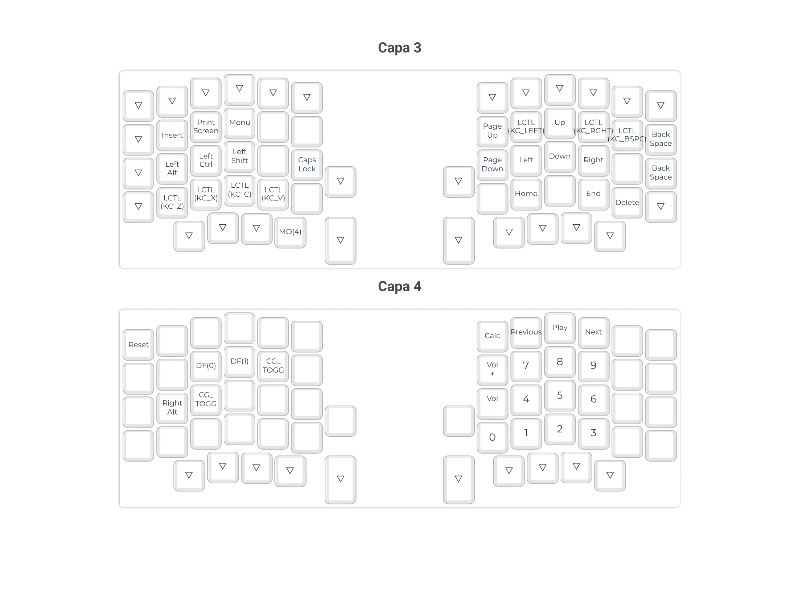

# SofleKeyboard-English-Spanish

Configuración para teclado Sofle v2 RGB (Windows QWERTY).

Utilizar el idioma Inglés con la posibilidad de escribir caracteres Ñ y tildes (á é í ó ú) sin salir de la posición de touch typing (En proceso)

